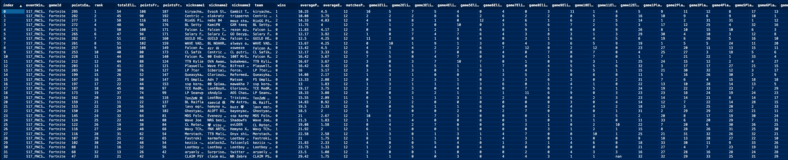

## Why Fortnite?

I love Fortnite, it's far and away my favorite game. Don't know how it works? That's okay, it's a pretty simple premise. One hundred players (or 99 if it's trios) land on an island and battle it out to be the last one (team) standing. It's a household name across the world, with, [as of last May, more than 350 million people having played the game.](https://www.statista.com/statistics/746230/fortnite-players/#:~:text=Having%20burst%20onto%20the%20scene,globe%20as%20of%20May%202020.) Fornite became so popular so quickly that less than two years after launch, they hosted the [Fortnite World Cup](https://en.wikipedia.org/wiki/Fortnite_World_Cup) where less than 200 players (out of 40 million competitors) qualified to compete for a cut of the whopping $30 million prizepool (the largest in esports history).

World Cup helped Epic Games prove to the gaming community that they had built a highly-competetive and compelling esport. And what helped their game stick out from other esports was the fact they could host their tournaments not only in person at [LAN events](https://en.wikipedia.org/wiki/LAN_party), but in open-format, online settings as well. Thus, in September of 2019, they hosted their first [Fortnite Champion Series (FNCS)](https://www.epicgames.com/fortnite/competitive/en-US/events/season-x) online tournament. And since Fortnite releases major content updates every few months in the form of new "seasons," an accompaning FNCS tournament caps off each season of competitive play. 

I'm more invested in these Fortnite tourneys than a Lambeau Field Cheesehead is in their precious Green Bay Packers. I find the storylines with each player to be very fascinating. Since [most of these players are in their teens](https://screenrant.com/fortnite-youngest-professional-player-8-years-old/), playing in these tournaments means, possibly, winning life-changing amounts of money. And the kind of skill that it takes to compete in this game at the highest level is absolutely insane - no other esport comes remotely close. I've been following the competitive Fortnite scene with undivided attention since last March. Over this same span of time, although admitedly probably more recently, I've developed a love for data science. In this time I've noticed a gap in the Fortnite scene. There's the developers that make the game, the players that compete in the game, the coaches that mentor the players, and those same developers that make the players' data publicly available. But as far as I can tell, there's currently no data scientists that are analyzing this data, at least not on a large enough scale that I've seen. 

That's where I come in.

## Getting the Data

With hundreds of thousands of players competing in online tournaments in their respective [regions](https://www.epicgames.com/help/en-US/fortnite-c75/battle-royale-c93/where-are-fortnite-s-servers-located-a3301), their performance data is all documented at [fortnitetracker.com](https://fortnitetracker.com/). I've known for awhile that I wanted to do my senior project involving this data, but I didn't realize until recently that in order for me to obtain this data in any sort of sustainable way, I'd have to webscrape it. I was counseled by a fellow Fortnite enthusiast, also a data scientist, to use the Python package `Beautiful Soup` to scrape and parse this data. I've had a decent amount of experience programming in Python and a lot of experience programming in general, so I figured I could teach myself the basics (with some help from a few articles and YouTube videos).

There are lot's of different types of pages on Fortnite Tracker, but I decided to focus on scraping a single page - an [event's page](https://fortnitetracker.com/events/epicgames_S17_FNCS_Finals_NAE?window=S17_FNCS_Finals_NAE_Round2&sm=floating) from the most recent FNCS Grand Finals. 

Getting my script started was simple enough, just importing the proper libraries to be able to access and parse the HTML, and manipulate the data:

```python
import requests
from bs4 import BeautifulSoup as soup 
import json
import pandas as pd
import numpy as np
```

Then I requested the url and parsed the respective HTML:

```python
# url
url = "https://fortnitetracker.com/events/epicgames_S17_FNCS_Finals_EU?window=S17_FNCS_Finals_EU_Round2&sm=floating"
# requesting the webpage
r = requests.get(url)
# defining my html parser and parsing the webpage html
soup = soup(r.content, "html.parser")
```

Next came the fun part - digging through the source code of the webpage and finding where the data was buried. I'm really familiar with the website itself, so finding the data was fairly straightfoward. It also helps that all of the data I needed was stored in JSON formatted dictionaries, and parsing through those dictionaries was easy enough using the `JSON` package:

```python
# extracting the piece of the JSON that I want 
script = soup.find_all("script", type = "text/javascript")[22].string[22:-1]
# storing the scraped JSON
dat = json.loads(script)
```

There's loads of HTML chunks with a "script" tag, so I had to specify which one I wanted to grab. Conveniently, all the data I need is stored in a single script chunk. And that data is also conveniently stored in two dictionaries:

1. Each player's account information - `accounts`
2. Each player's (team's) match history and tournament performance data - `entries`

```python
# defining each player's account name, nickname, player ID, and other information
accounts = dat["internal_Accounts"]
# defining each entry within the event
entries = dat["entries"]
```

The `accounts` dictionary was a simple one, and `pd.DataFrame` seamlessly tranforms a dictionary into a dataframe. It stored the data wide-ways, so I had to transpose the data to be long-ways:

```python
# defining each player account in the tournament
accounts = pd.DataFrame(accounts)
# pivoting the dataframe long-ways
accounts_long = accounts.transpose().reset_index()
# renaming index column
accounts_long.rename(columns = {"index": "playerId"}, inplace = True)
```

Figuring that part out took 20 minutes. Figuring out the `entries` dictionary took much longer. I had to dig into dictionaries within dictionaries within dictionaries. I watched some helpful videos and spent a lot of time on Stack Overflow, and I was able to figure it out: I successfully wrote a script that stores the relevant data in a tidy dataframe that I'll be using to make visualizations and report other interesting analytics. Here's the code that ***I WROTE!***

```python
# turning the entries list (JSON) into a dataframe
entries_dat = pd.DataFrame(entries)

# separating the player ID's into three distinct columns
entries_dat[["player1", "player2", "player3"]] = pd.DataFrame(entries_dat.teamAccountIds.tolist(), index = entries_dat.index)

# initiate a list for total elims for each team
totalElimsList = []

# iterate through each team and add their total elims
for entry in entries:
    pointBreakdown = entry["pointBreakdown"]
    elims = pointBreakdown["TEAM_ELIMS_STAT_INDEX:1"]
    totalElims = elims["timesAchieved"]
    totalElimsList.append(totalElims)

# convert this list to an array
totalElimsArray = np.asarray(totalElimsList)

# creating a total elims column
entries_dat["totalElims"] = totalElimsArray

# initiate a list for elim points for each team
pointsFromElimsList = []

# iterate through each team and add their elim points
for entry in entries:
    pointBreakdown = entry["pointBreakdown"]
    elims = pointBreakdown["TEAM_ELIMS_STAT_INDEX:1"]
    pointsFromElims = elims["pointsEarned"]
    pointsFromElimsList.append(pointsFromElims)

# convert this to an array
pointsFromElimsArray = np.asarray(pointsFromElimsList)

# creating a elims points column
entries_dat["pointsFromElims"] = pointsFromElimsArray

# creating a column for placement points
entries_dat["pointsFromPlacement"] = entries_dat["pointsEarned"] - entries_dat["pointsFromElims"]

# dropping irrelevant columns
entries_dat = entries_dat.drop(columns = ["pointBreakdown", 
  "eventId", "percentile", "score", "sessionHistory", "sessionStats", "teamAccountIds", "teamId", "tokens"])

entries_dat["playerId"] = entries_dat["player1"]

# joining the first player's nickname on playerId and calling it teams
teams = entries_dat.merge(accounts_long, on = "playerId", how = "left")

# dropping irrelevant columns
teams = teams.drop(columns = ["countryCode", "twitchName", "twitchId"])

# renaming "nickname" to "nickname1"
teams["nickname1"] = teams["nickname"]

# dropping "nickname" and "playerId"
teams = teams.drop(columns = ["nickname", "playerId"])

# renaming "player2" to "playerId"
teams["playerId"] = teams["player2"]

# join on playerId
teams = teams.merge(accounts_long, on = "playerId", how = "left")

# dropping irrelevant columns
teams = teams.drop(columns = ["countryCode", "twitchName", "twitchId"])

# renaming nickname
teams["nickname2"] = teams["nickname"]

# dropping "nickname" and "playerId"
teams = teams.drop(columns = ["nickname", "playerId"])

# renaming player3
teams["playerId"] = teams["player3"]

# joining third player's nickname
teams = teams.merge(accounts_long, on = "playerId", how = "left")

# renaming nickname
teams["nickname3"] = teams["nickname"]

# drop irrelavent columns
teams = teams.drop(columns = ["countryCode", "playerId", "twitchName", "twitchId", "nickname"])

# creating team name column
teams = teams.assign(team = teams["nickname1"].astype(str) + ', ' +
teams["nickname2"].astype(str) + ', ' + teams["nickname3"].astype(str))

# dropping irrelevant columns
teams = teams.drop(columns = ["player1", "player2", "player3"])

# initiate a list for average elims for each team
avgElimsList = []

# iterate through each team and add their average elims to the list
for entry in entries:
    sessionStats = entry["sessionStats"]
    avgElims = sessionStats["avgElims"]
    avgElimsList.append(avgElims)

# initiate a list for average placement
avgPlaceList = []

# iterate through each team and add their average placement to the list
for entry in entries:
    sessionStats = entry["sessionStats"]
    avgPlace = sessionStats["avgPlace"]
    avgPlaceList.append(avgPlace)

# initiate a list for total wins per team
winsList = []

# iterate through each team and add their total wins to the list
for entry in entries:
    sessionStats = entry["sessionStats"]
    wins = sessionStats["wins"]
    winsList.append(wins)

# initiate a list for games played per team
matchesList = []

# iterate through each team and add their matches played
for entry in entries:
    sessionStats = entry["sessionStats"]
    matches = sessionStats["matches"]
    matchesList.append(matches)

# convert all these lists to arrays to be able to merge with the main data frame
avgElimsArray = np.asarray(avgElimsList)
avgPlaceArray = np.asarray(avgPlaceList)
matchesArray = np.asarray(matchesList)
winsArray = np.asarray(winsList)

# adding these arrays as columns in "teams"
teams["wins"] = winsArray
teams["averagePlace"] = avgPlaceArray
teams["averageElims"] = avgElimsArray
teams["matchesPlayed"] = matchesArray

# initiating a list
elimsPerGameList = []

# storing each team's elims per game in a long list
# looping through each team in entries
for entry in entries:
    sessionHistory = entry["sessionHistory"]
    # looping through each match each team plays
    for session in sessionHistory:
        matchStats = session["matchStats"]
        elims = matchStats["elims"]
        elimsPerGameList.append(elims)

# setting n to 12, since each team plays matches
n = 12

# converting this long list into a list of 33 lists, each with 12 elements (one for each match played)
output = [elimsPerGameList[i:i + n] for i in range(0, len(elimsPerGameList), n)]

# turning this list of lists into a data frame that I can concat with "teams" df
elimsPerGameDF = pd.DataFrame(output)

# initiating a list
placementPerGameList = []

# storing each team's elims per game in a long list
# looping through each team in entries
for entry in entries:
    sessionHistory = entry["sessionHistory"]
    # looping through each match each team plays
    for session in sessionHistory:
        matchStats = session["matchStats"]
        placement = matchStats["placement"]
        placementPerGameList.append(placement)

# setting n to 12, since each team plays matches
n = 12

# converting this long list into a list of 33 lists, each with 12 elements (one for each match played)
output = [placementPerGameList[i:i + n] for i in range(0, len(placementPerGameList), n)]

# turning this list of lists into a data frame that I can concat with "teams" df
placementPerGameDF = pd.DataFrame(output)

# a dictionary with old and new column names
elimsDict = {0: "game1Elims",
             1: "game2Elims",
             2: "game3Elims",
             3: "game4Elims",
             4: "game5Elims",
             5: "game6Elims",
             6: "game7Elims",
             7: "game8Elims",
             8: "game9Elims",
             9: "game10Elims",
             10: "game11Elims",
             11: "game12Elims",
             }

# renaming the columns
elimsPerGameDF.rename(columns = elimsDict, inplace = True)

# a dictionary with old and new column names
placementDict = {0: "game1Placement",
             1: "game2Placement",
             2: "game3Placement",
             3: "game4Placement",
             4: "game5Placement",
             5: "game6Placement",
             6: "game7Placement",
             7: "game8Placement",
             8: "game9Placement",
             9: "game10Placement",
             10: "game11Placement",
             11: "game12Placement",
             }

# renaming the columns 
placementPerGameDF.rename(columns = placementDict, inplace = True)

# combining the three dataframes
teams = pd.concat([teams, elimsPerGameDF, placementPerGameDF], axis=1)
```

And here's what the dataframe looks like:




## What I Learned

I learned a couple things while writing this code:

1. I'm smarter than I think. While I may not know the answers to everything, I know how to think through those problems to reach a solution.
2. Asking for help saves a lot of time. Towards the beginning of this project, I got stuck at a few dead ends that prevented me from making any progress (despite hours of Googling). I decided to ask an old CS professor if he had any idea why I was stuck. He indentified the problem immediately and, from then on, my progress was twice as fast. He told me that sometimes 10 minutes with an expert can be worth hours of searching on the internet.

I'm super proud of the work I've been able to do so far and I'm looking forward to building out my dashboard/reporting tool to bring this project full circle.


